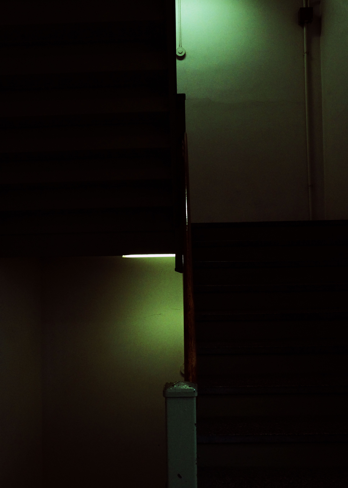
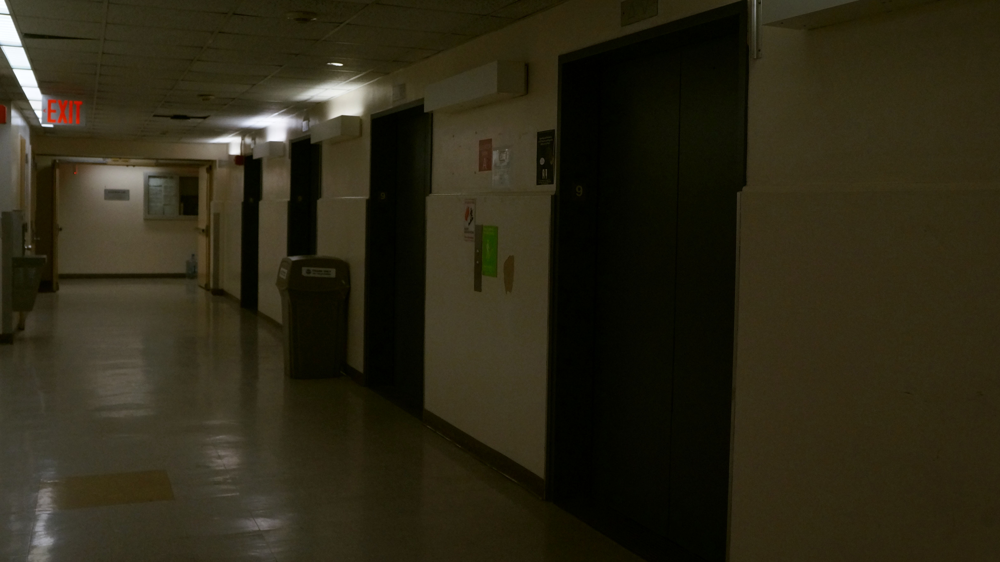

<!DOCTYPE html>
<html lang="en">
<body>

  <h1>Homework 2</h1>

  

 I was inspired by the staircase’s natural checkered pattern, as well as the parallel line of light.
 The raw image captured the contrast of the dark gray against the white, but the line of light didn’t stand out.
 As I worked in the camera raw filter, I played around with different colors, finding what I felt best fit the tone of the image.
 Increasing the contrast and highlights caused the once muted light to stand out. I debated between green and purple when testing 
 out the tint spectrum. Purple reminded me of a staircase on a night out, however, green sets an almost apocalyptic ambience.
  

  

  The ninth floor of the east building offers a sterile like feeling, one similar to an unexpected hospital visit.
  The line of elevators leading down the hallway guides your eyes to the end of the hallway and I also like the
  yellow tile that stands out amongst the others. I decreased the shadows to add to the almost eerie feeling. 
  By increasing the temperature, it added warmth which brought out the walls.
  

   

  <a> href="index.html">Back to Home</a>

</body>
</html>
