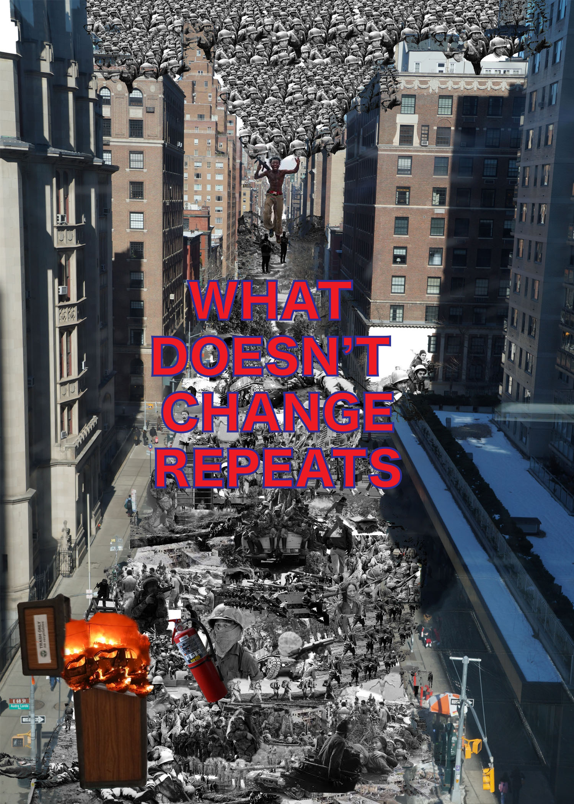
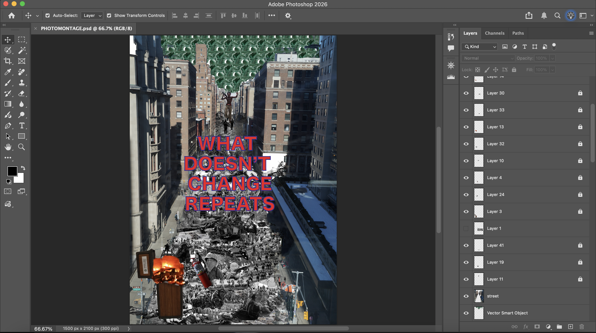

<html lang="en">
<body>

  <h1>Homework 4</h1>

  

An issue I aimed to address with my photomontage include the daily atrocities that ICE has been committing, the deployment of National Guard troops across cities in America, and overall excessive and unlawful force against black and brown communities in the U.S. I left the saturation unadjusted for the buildings to represent the present we’re living in and used a combination of varying photographs during war and other eventful periods in time. Sprinkled within photographs that trace back decades are current events: ICE ripping apart families— a guise for the intended abuse against those who don’t fit the current presidency’s rule of “acceptable.” I chose a black and white filter for the images in the streets to represent what is believed to be “in the past” but is only lurking and mutating. The addition of toy soldiers represents the deployment of the National Guard in Washington, D.C. since August of 2025. Despite the deployment accruing a projected balance of over $1 billion this year, they are played with like disposable dolls. My message of “What Doesn’t Change Repeats” aims to call to attention to the cycle of war and violence that we are trapped in. Many of the photos interact with each other to show that war affects all, both directly and indirectly. I used red and blue as the colors for my message to symbolize the promises America has betrayed. This topic is important to me because it is an issue that has and will affect us all. It’s revolting to see humans treated less than and facing injustice, something we were told would never happen again.
     
 I took a photo of the street view from the skybridge of Lexington Ave and 68th Street to capture my intended base layer. I found an open trash can that I found interesting and a fire extinguisher that caught my eye. I used the darken blend mode on this picture because it caused the darker parts of the street view to match the collage. From there I scoured the internet for photos of various wars, both past and present, to build the collage that would represent the “war in the streets.” I used the quick selection tool to get a jagged edged selection of photos to make it easier to blend and overlap. I found the image for a toy soldier on istockphoto.com and uploaded it to Photoshop where I again used quick selection and transferred it over to Illustrator. From there I was able to create a pattern from the image and used the rectangle tool to create a rectangle that would fit my allotted space. I then transferred it back to Photoshop as a smart object and adjusted to fill the open space. I then used the eraser tool to get rid of any overlap. I also used Illustrator to create my message using the type tool. 

  

   

  <a href="index.html">Back to Home</a>

</body>
</html>
